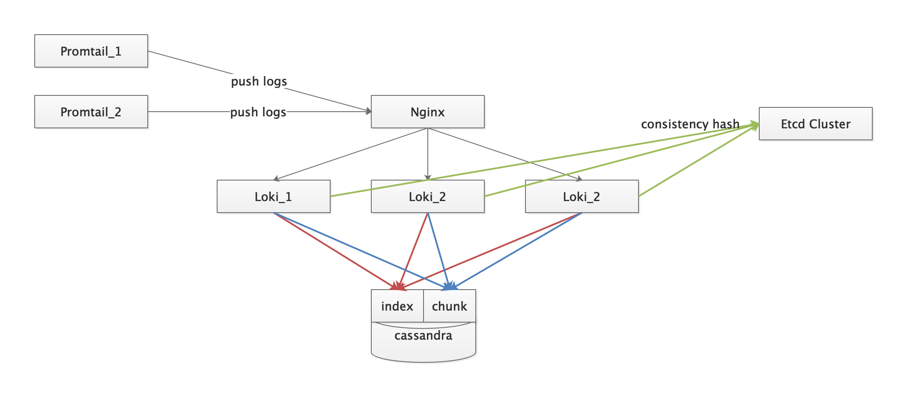

# muta monitor ha 部署
该文档用于说明 muta monitor 组件的高可用部署方式
- Grafana
- Promethues
- Loki
- jaeger

## Grafana
[官文推荐的高可用部署方式](https://grafana.com/docs/grafana/latest/tutorials/ha_setup/)

## Promethues
Promethues 的高可用主要通过以下两个方面解决
- [联邦集群](https://prometheus.io/docs/prometheus/latest/federation/)
- [远程存储](https://prometheus.io/docs/prometheus/latest/storage/)

### 组件列表
| 组件名 | 参考链接 | 说明 |
| --- | --- | --- |
| influxdb | [influxdb home](https://docs.influxdata.com/influxdb/v1.8/administration/config/) | 存储的组件，可根据官方文档替换 | 
| prometheus | [prometheus home](https://prometheus.io/docs/prometheus/latest/federation/ ) | - |
| remote-storage-adapter | [remote-storage-adapter git](https://github.com/prometheus/prometheus/blob/master/documentation/examples/remote_storage/remote_storage_adapter/README.md) | 处理 remote storage 的组件 |

### 逻辑结构

## Loki
Loki 的高可用通过以下三个方面解决
- 一致性哈希
- 数据持久化
- 负载均衡

### 组件列表
| 组件名 | 参考链接 | 说明 |
| --- | --- | --- |
| loki | - | - |
| etcd | [官方一致性哈希配置](https://grafana.com/docs/loki/latest/configuration/) | 存储一致性哈希，可根据官方文档替换 |
| cassandra | [官方持久化配置参考](https://grafana.com/docs/loki/latest/storage/) | 可根据官方文档替换 |
| nginx | - | 用于处理集群后的请求分发 |
| promtail | - | log 采集，可根据官方文档替换，跟随应用部署 |

### 逻辑结构

## Jaeger

| 组件名 | 参考链接 | 说明 |
| --- | --- | --- |
| elasticsearch | [elasticsearch docs](https://www.elastic.co/guide/en/elasticsearch/reference/current/index.html) | 用于存储数据，可根据官方文档替换 |
| jaeger-collector | [官方配置文档](https://www.jaegertracing.io/docs/1.18/cli/) | 用于接收 agent push 的数据 |
| jaeger-query | 同上 | 用于查询数据 |
| jaeger-agent | 同上 | 用于与 client 交互，跟随应用部署 |

### 逻辑结构

